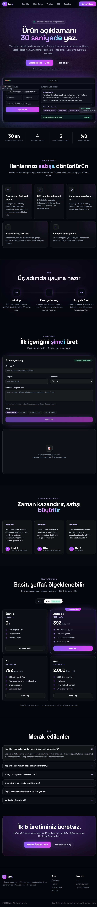
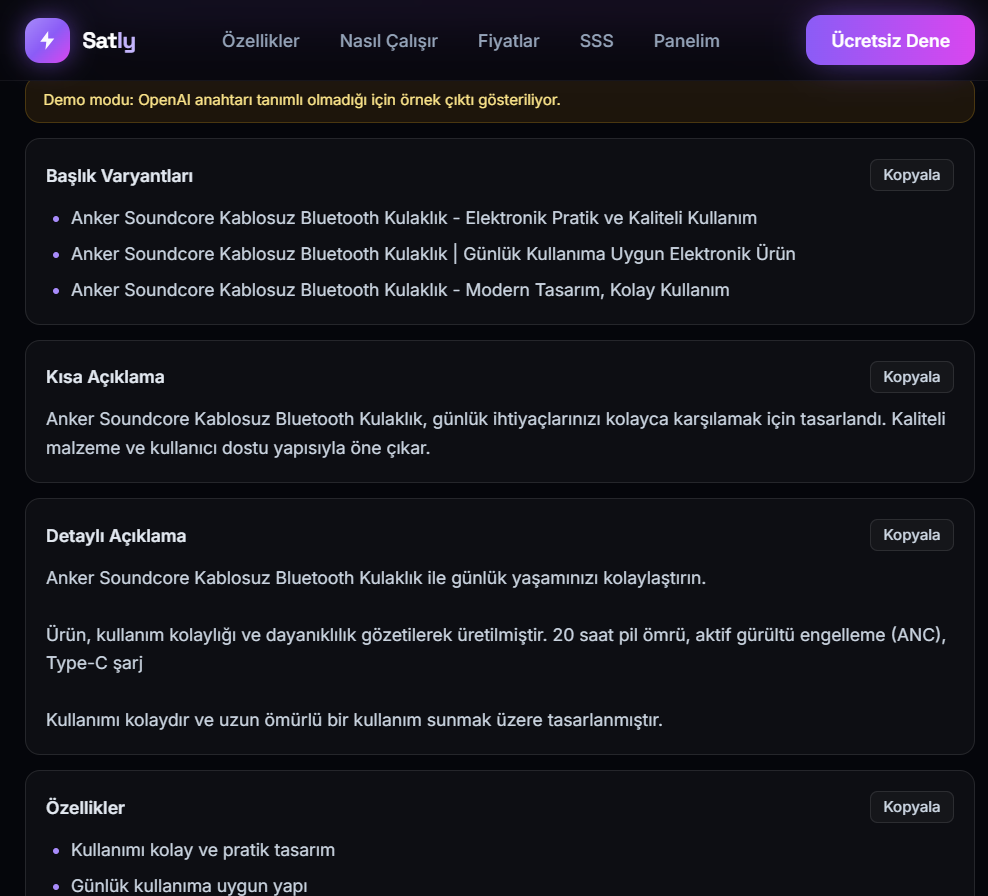

<div align="center">

# ⚡ Satly

### E-ticaret metnini yapay zekâya bırak.

Ürün adını yaz; **30 saniyede** satışa hazır başlık, açıklama, özellik listesi ve
SEO anahtar kelimelerini al. **Trendyol · Hepsiburada · Amazon TR · Shopify** için
Türkçe yapay zekâ.

<br />


<br />


</div>

---

## ✨ Nedir?

Satly, e-ticaret satıcılarının saatler süren ürün metni yazma işini saniyelere indiren
bir **Türkçe yapay zekâ içerik üretecidir**. Pazaryerine özel format, SEO anahtar
kelimeleri ve satış odaklı ton ile ürün ilanlarını zahmetsizce hazırlar.

## 🚀 Öne çıkan özellikler

- 🧠 **Pazaryerine özel üretim** — Trendyol'un kısa başlığı, Amazon'un 5 maddesi,
  Shopify'ın marka anlatımı; her kanala uygun çıktı.
- 🔍 **SEO anahtar kelimeleri** — Ürününüzün aramada bulunmasını sağlayan doğal terimler.
- 🎭 **4 üslup** — Profesyonel, samimi, premium, genç & enerjik.
- 📷 **Görselden içerik** — Ürün fotoğrafını yükle; yapay zekâ görselde görünen
  özellikleri (renk, biçim, tür) açıklamaya katar.
- 🌍 **Çoklu dil** — Türkçe veya İngilizce çıktı (ihracatçı satıcılar için).
- 🗂️ **Toplu üretim** — Ürün listeni yapıştır, onlarca içeriği tek seferde üret, CSV indir.
- 🧮 **Kâr hesaplayıcı** — Komisyon, KDV ve marja göre ideal satış fiyatı (ücretsiz araç).
- 🔢 **Karakter sayacı** — Başlıklar pazaryeri limitine göre renkli uyarı verir.
- 🛡️ **Uydurma yok** — Bilinmeyen teknik özellik uydurulmaz; güvenli ifade kullanılır.
- 📋 **Kopyala & indir** — Tek tıkla kopyala ya da **CSV/TXT** indir (Excel uyumlu).
- ⚡ **Demo modu** — OpenAI anahtarı olmadan da çalışır, örnek çıktı üretir.
- 🔒 **Güvenli** — API anahtarı asla tarayıcıya gönderilmez; hız sınırı ile korunur.
- 🗂️ **Panel & geçmiş** — Üretilen içerikleri saklar.

## 📸 Ekran görüntüleri

<div align="center">

### Tüm sayfa


### Üretim sonucu


</div>

## ⚙️ Hızlı Başlangıç

```bash
git clone https://github.com/Hasanx77/satly.git
cd satly
npm install
cp .env.example .env.local     # Windows: copy .env.example .env.local
npm run dev
```

Tarayıcıda **http://localhost:3000** adresini aç.

> 💡 `.env.local` içine `OPENAI_API_KEY` girmezsen uygulama **demo modu**nda çalışır ve
> örnek çıktı üretir. Gerçek yapay zekâ için anahtarını ekle.

## 🔑 Ortam Değişkenleri

| Değişken | Zorunlu | Açıklama |
|---|---|---|
| `OPENAI_API_KEY` | Gerçek üretim için | OpenAI API anahtarı (yoksa demo modu) |
| `OPENAI_MODEL` | Hayır | Varsayılan: `gpt-4o-mini` |
| `NEXT_PUBLIC_SITE_URL` | Önerilir | Site adresi (sitemap/robots) |
| `NEXT_PUBLIC_SUPABASE_URL` / `NEXT_PUBLIC_SUPABASE_ANON_KEY` | Hayır | Hesap fazı (2. aşama) |

## 🛠️ Teknoloji

| Katman | Teknoloji |
|---|---|
| Çatı | Next.js 14 (App Router) + TypeScript |
| Arayüz | Tailwind CSS |
| Yapay zekâ | OpenAI (`gpt-4o-mini`) |
| Doğrulama | Zod |
| Veritabanı (planlı) | Supabase (PostgreSQL + RLS) |
| Barındırma | Vercel |

## 📁 Proje Yapısı

```
satly/
├─ src/
│  ├─ app/
│  │  ├─ page.tsx                    # Ana sayfa
│  │  ├─ panel/page.tsx              # Kullanıcı paneli
│  │  ├─ toplu/page.tsx              # Toplu üretim
│  │  ├─ araclar/baslik-uretici/     # Ücretsiz araç (SEO)
│  │  ├─ araclar/kar-hesaplayici/    # Kâr & fiyat hesaplayıcı
│  │  └─ api/generate/route.ts       # AI üretim ucu
│  ├─ components/                    # Navbar, Generator, ResultCard, Pricing, Faq
│  └─ lib/                           # prompts, plans, types, rate-limit, supabase
├─ supabase/schema.sql               # Veritabanı şeması
├─ docs/                             # GTM, roadmap, devir raporu
└─ .env.example
```

## 🧪 Komutlar

| Komut | İş |
|---|---|
| `npm run dev` | Geliştirme sunucusu |
| `npm run build` | Üretim derlemesi |
| `npm run start` | Derlenmiş sürümü çalıştır |
| `npm run test:api` | API ve rota testleri (sunucu açıkken) |

## 🗺️ Yol Haritası

- [x] MVP: üretim motoru, kopyala/indir, panel, demo modu
- [x] Premium koyu tema + fiyatlandırma + SSS
- [x] API test paketi
- [x] Görselden içerik (vision) + Türkçe/İngilizce çıktı
- [ ] Supabase hesap sistemi ve bulut geçmiş
- [ ] iyzico/PayTR abonelik ve faturalama
- [x] Toplu üretim + kâr hesaplayıcı + karakter sayacı + PWA
- [ ] Pazaryeri resmi API entegrasyonları

## 📄 Lisans

Özel proje. © 2026 Satly — Tüm hakları saklıdır.

---

<div align="center">
<sub>Satly ile daha az yaz, daha çok sat. ⚡</sub>
</div>
